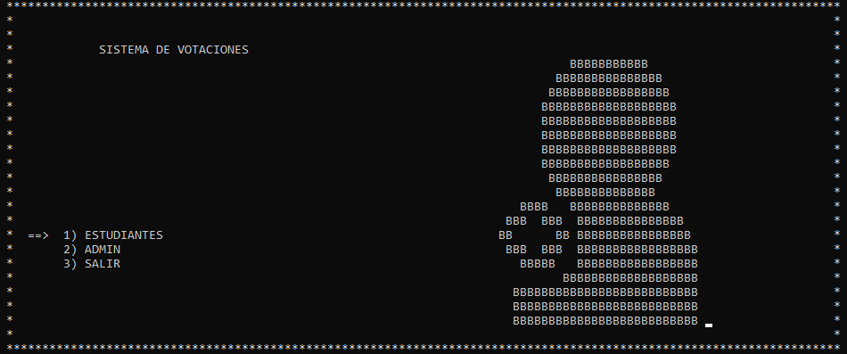
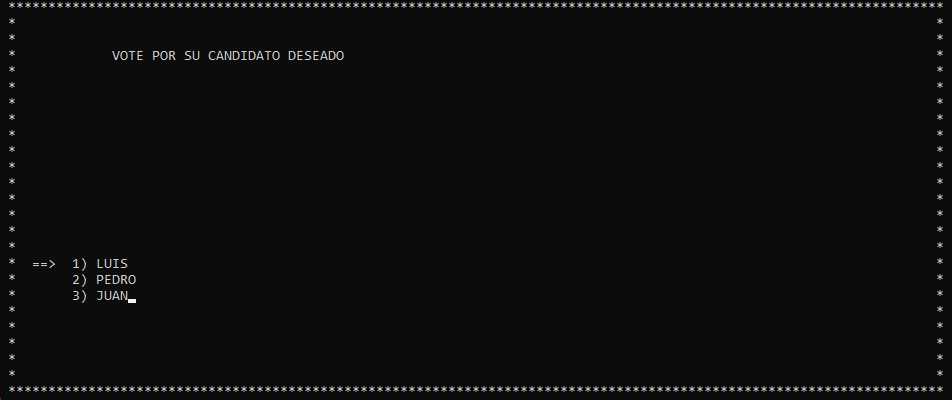
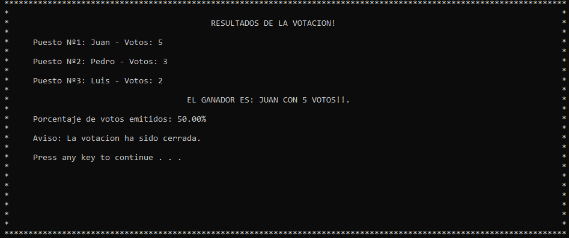

# 🗳️ Votaciones AEIS - Sistema de Voto Electrónico

Este es un sistema de voto electrónico interactivo desarrollado en **C** para simular un sistema de votaciones basado en la Asociación de Estudiantes de Ingeniería de Software (AEIS). El programa corre directamente en la consola de comandos de forma dinámica y visual.

---

## 📋 Información del Proyecto
* **Lenguaje utilizado:** C
* **Entorno de desarrollo:** Visual Studio Code

---

## ✨ ¿Qué hace este programa?

* **Menú visual e interactivo:** Los menús se pueden usar con las flechas del teclado (`↑` / `↓`) y seleccionas con `Enter`.
* **Persistencia de datos (Archivos `.txt`):** El programa guarda los datos necesarios de la votación, estos no se borran al cerrar el programa.
* **Control de trampas:** El sistema valida la ID del estudiante para que nadie vote dos veces y revisa una lista de usuarios baneados.
* **Panel de Admin:** El panel esta protegido con contraseña, y permite gestionar todo el sistema de votación de manera segura.

---

## 🛠️ Archivos que utiliza el sistema

* **`ElectionInfo.txt`:** Guarda los datos generales de la elección (año, estado, límites de votos, etc.).
* **`CandidatoX.txt`:** Almacena el conteo de votos de cada lista y quiénes votaron por ellos.
* **`Baneados.txt`:** Lista de personas que no tienen permitido votar.

---

## 🚀 ¿Cómo probarlo?

Al usar librerías nativas de Windows (como `<conio.h>`), el proyecto está pensado para ejecutarse en este sistema operativo.

1. Abre tu terminal en Visual Studio Code.
2. Compila el código:
   ```bash
   gcc main.c -o VotacionesAEIS.exe
   ```
3. Ejecútalo:
   ```bash
   ./VotacionesAEIS.exe
   ```

*🔑 **Datos de acceso de administrador por defecto:** `admin` / `1234abcd`*

---

## 📸 Capturas de pantalla

| Menú de Inicio | Proceso de Votación | Resultados |
| :---: | :---: | :---: |
|  |  |  |
